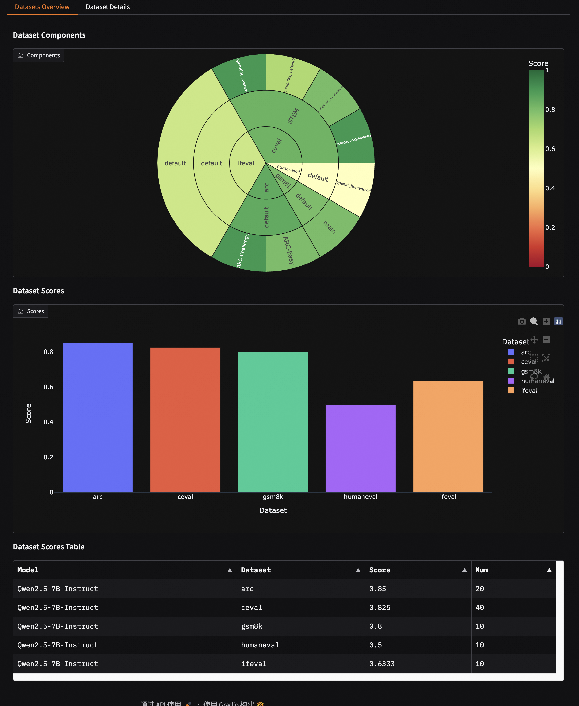
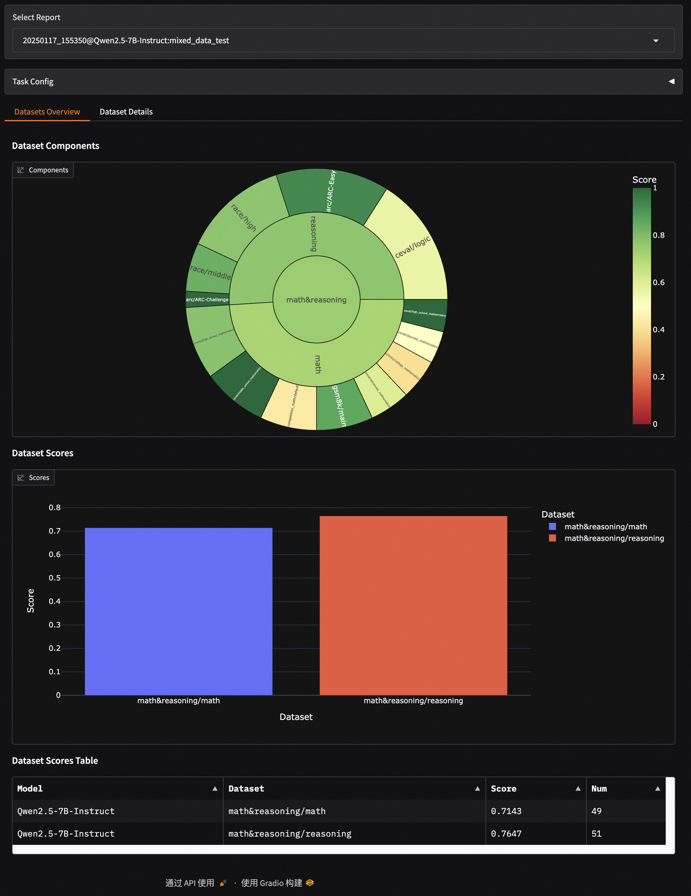

# Visualization

Visualization supports single model evaluation results and multi-model comparison, as well as visualization of mixed dataset evaluations.

## Quick Start

Run the following command to quickly experience the visualization function, where the evaluation samples of Qwen2.5-0.5B and Qwen2.5-7B models on multiple datasets are included.

```bash
git clone https://github.com/modelscope/evalscope
cd evalscope
pip install -e '.[app]'
evalscope app --outputs examples/viz
```

## Install Dependencies

Install the dependencies required for visualization, including gradio, plotly, etc.
```bash
pip install 'evalscope[app]' -U
```

```{note}
Visualization requires `evalscope` version greater than or equal to `0.10.0`. If the version is less than `0.10.0`, please upgrade `evalscope` first.
```

## Start Visualization Service

Run the following command to start the visualization service.
```bash
evalscope app
```
The supported command-line arguments are as follows:

- `--outputs`: A string type used to specify the root directory of the evaluation report, with a default value of `./outputs`.
- `--share`: A flag indicating whether to share the application.
- `--server-name`: A string type with a default value of `None`, used to specify the server name.
- `--server-port`: An integer type with a default value of `None`, used to specify the server port.
- `--debug`: A flag indicating whether to debug the application.

You can access the visualization service in the browser if the following output appears.
```text
* Running on local URL:  http://127.0.0.1:7861

To create a public link, set `share=True` in `launch()`.
```

## Features Introduction

1. Configuration options on the left:
   - Root directory of evaluation reports
   - Selection of evaluation reports
   

2. Single Model Evaluation Results:
   - Evaluation Overview: Displays the composition of the evaluation dataset and the evaluation results
   
   - Detailed evaluation of a single dataset, including model prediction results
   

3. Comparison of Multiple Model Evaluation Results:
   - Displayed using radar charts and comparison tables
   

4. Visualization of Mixed Dataset Evaluations:
   - Visual representation based on model capability dimensions
   