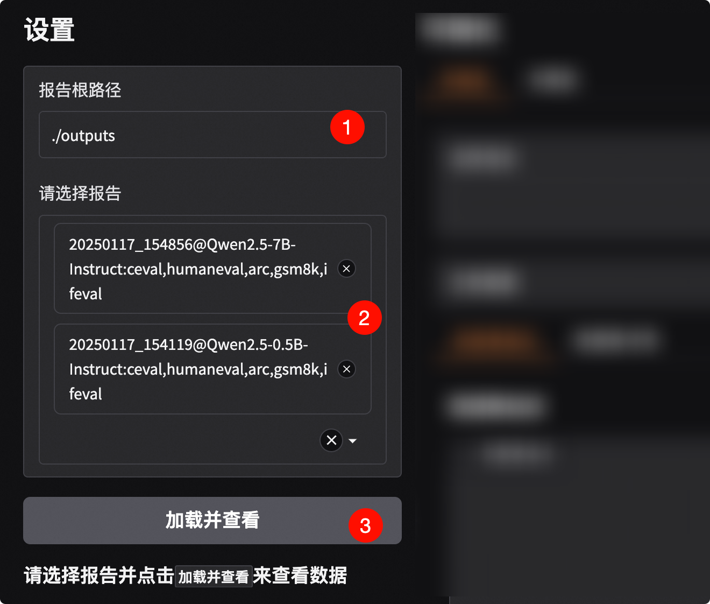
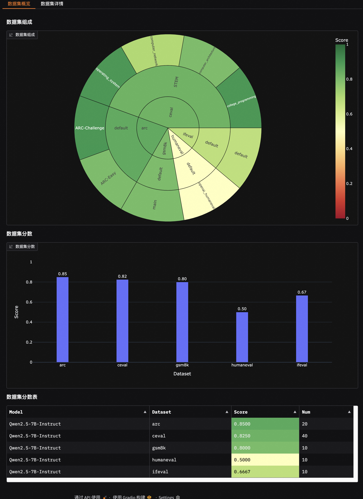
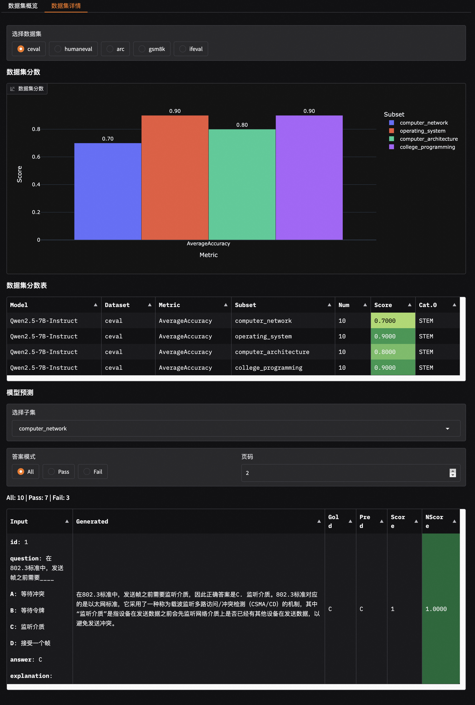
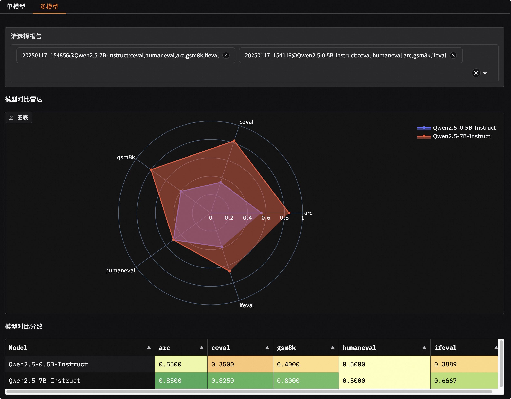

# 可视化

可视化功能支持单模型评测结果和多模型评测结果对比，支持数据集混合评测可视化。


## 安装依赖

安装可视化所需的依赖，包括gradio、plotly等。

```bash
pip install 'evalscope[app]' -U
```
```{note}
可视化功能需要`evalscope>=0.10.0`输出的评测报告，若版本小于`0.10.0`，请先升级`evalscope`进行模型评测。
```

## 启动可视化服务

运行如下命令启动可视化服务。
```bash
evalscope app
```

支持的命令行参数如下：

- `--outputs`: 类型为字符串，用于指定评测报告所在的根目录，默认值为`./outputs`。
- `--share`: 作为标志参数，是否共享应用程序。
- `--server-name`: 类型为字符串，默认值为`None`，用于指定服务器名称。
- `--server-port`: 类型为整数，默认值为`None`，用于指定服务器端口。
- `--debug`: 作为标志参数，是否调试应用程序。

输出如下内容即可在浏览器中访问可视化服务。
```text
* Running on local URL:  http://127.0.0.1:7861

To create a public link, set `share=True` in `launch()`.
```

### 快速体验

运行如下命令，即可下载样例并快速体验可视化功能，样例中包含Qwen2.5-0.5B和Qwen2.5-7B模型在多个数据集上部分示例的评测结果。

```bash
git clone https://github.com/modelscope/evalscope
evalscope app --outputs evalscope/examples/viz
```

## 功能介绍

1. 左侧配置选项：
   - 评测报告的根目录
   - 评测报告选择
   

2. 单模型评测结果：
   - 评测总览：展示评测数据集的组成和评测结果
   
   - 单个数据集评测详情，包含模型预测结果展示
   

3. 多模型评测结果对比：
   - 使用雷达图和对比表格进行展示
   

4. 数据集混合评测可视化：
   - 按照模型能力维度进行可视化展示
   