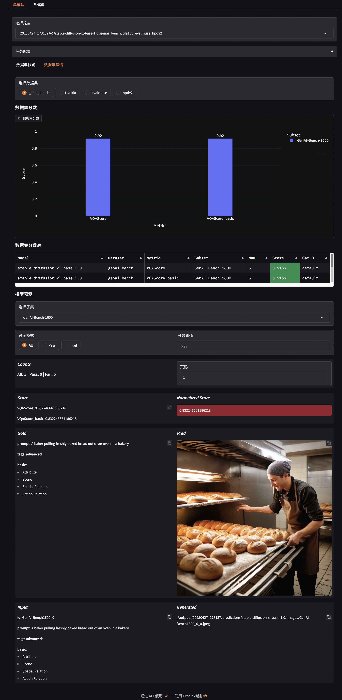

# 文生图评测

EvalScope框架支持多种文生图模型的评测，包括Stable Diffusion、Flux等。用户可以通过EvalScope框架对这些模型进行评测，获取模型在不同任务上的性能指标。

## 支持的评测数据集

请参考[文档](../../get_started/supported_dataset.md#aigc-评测集)。

## 支持的评测指标

EvalScope框架支持多种评测指标，用户可以根据需求选择合适的指标进行评测。以下是支持的评测指标列表：


| 评估指标        | 项目地址       | 打分范围（越高越好）       | 备注           |
|-----------------|----------------|---------------|---------------|
| `VQAScore`        | [Github](https://github.com/linzhiqiu/t2v_metrics) | [0, 1]（通常）      | 用问答方式评估图文一致性 |
| `CLIPScore`       | [Github](https://github.com/linzhiqiu/t2v_metrics) | [0, 0.3]（通常） | 使用CLIP评估图像与文本的匹配程度 |
| `BLIPv2Score`     | [Github](https://github.com/linzhiqiu/t2v_metrics) | [0, 1]（通常）      | 使用BLIP的ITM评估图像与文本的匹配程度 |
| `PickScore`       | [Github](https://github.com/yuvalkirstain/PickScore) | [0, 0.3]（通常）      | 基于 CLIP 模型的评分系统，预测用户对生成图像的偏好 |
| `HPSv2Score`/`HPSv2.1Score` | [Github](https://github.com/tgxs002/HPSv2) | [0, 0.3]（通常）      | 基于人类偏好的评估指标，在人类偏好数据集（HPD v2）上进行训练 |
| `ImageReward`     | [Github](https://github.com/THUDM/ImageReward) | [-3, 1]（通常）      | 一种奖励模型，通过人类反馈训练，反映人类对图片的偏好 |
| `MPS`             | [Github](https://github.com/Kwai-Kolors/MPS) | [0, 15]（通常）      | 快手：一种多维度的偏好评分方法，综合考虑生成图像的多个属性（如逼真度、语义对齐等）来评估其质量 |
| `FGA_BLIP2Score`  | [Github](https://github.com/DYEvaLab/EvalMuse) | 总体 [0, 5]（通常，各维度为[0, 1]） | 字节跳动：用于评估细粒度的生成图像的质量和语义对齐 |


## 安装依赖

用户可以通过以下命令安装相关依赖：

```bash
pip install evalscope[aigc] -U
```

## Benchmark

用户可以通过以下命令配置文生图模型的评测任务。

下面展示使用modelscope的Stable Diffusion XL模型在`tifa160`上使用默认指标进行评测的示例代码：
```python
from evalscope import TaskConfig, run_task
from evalscope.constants import ModelTask

task_cfg = TaskConfig(
    model='stabilityai/stable-diffusion-xl-base-1.0',  # model id on modelscope
    model_task=ModelTask.IMAGE_GENERATION,  # must be IMAGE_GENERATION
    model_args={
        'pipeline_cls': 'DiffusionPipeline',
        'use_safetensors': True,
        'variant': 'fp16',
        'torch_dtype': 'torch.float16',
    },
    datasets=[
        'tifa160',
        'genai_bench',
        'evalmuse',
        'hpdv2',
    ],
    limit=5,
    generation_config={
        'height': 1024,
        'width': 1024,
        'num_inference_steps': 50,
        'guidance_scale': 9.0,
    }
)

# 运行评测任务
run_task(task_cfg=task_cfg)
```
### 参数说明
基本参数请参考：[参数说明](../../get_started/parameters.md)。

需要注意的参数如下：
- `model`: 模型ID，支持本地模型和modelscope model id。
- `model_task`: 模型任务类型，必须为`image_generation`。
- `model_args`: 模型加载参数，支持传入模型加载参数，包括：
    - `pipeline_cls`: `diffusers`中的用于加载模型`Pipeline`类，默认为`DiffusionPipeline`。下面的其余参数均为该`Pipeline`的参数，请参考[diffusers文档](https://huggingface.co/docs/diffusers/using-diffusers/loading)。
    - `use_safetensors`: 是否使用安全张量。
    - `variant`: 模型变体。
- `generation_config`: 生成参数，支持传入模型生成参数，具体支持的参数参考对应的`Pipeline`类，一般包括：
    - `height`: 生成图像的高度。
    - `width`: 生成图像的宽度。
    - `num_inference_steps`: 生成图像的推理步数。
    - `guidance_scale`: 生成图像的引导比例。

### 输出结果

评测完成后，EvalScope将输出评测结果，包括模型ID、数据集、指标、子集、数量和得分等信息。以下是输出结果的示例：


```text
+------------------------------+-------------+------------------------------+------------------+-------+---------+---------+
| Model                        | Dataset     | Metric                       | Subset           |   Num |   Score | Cat.0   |
+==============================+=============+==============================+==================+=======+=========+=========+
| stable-diffusion-xl-base-1.0 | evalmuse    | FGA_BLIP2Score:overall_score | EvalMuse         |     5 |  3.3148 | default |
+------------------------------+-------------+------------------------------+------------------+-------+---------+---------+
| stable-diffusion-xl-base-1.0 | evalmuse    | FGA_BLIP2Score:activity      | EvalMuse         |     2 |  0.4592 | default |
+------------------------------+-------------+------------------------------+------------------+-------+---------+---------+
| stable-diffusion-xl-base-1.0 | evalmuse    | FGA_BLIP2Score:attribute     | EvalMuse         |    11 |  0.8411 | default |
+------------------------------+-------------+------------------------------+------------------+-------+---------+---------+
| stable-diffusion-xl-base-1.0 | evalmuse    | FGA_BLIP2Score:location      | EvalMuse         |     2 |  0.8763 | default |
+------------------------------+-------------+------------------------------+------------------+-------+---------+---------+
| stable-diffusion-xl-base-1.0 | evalmuse    | FGA_BLIP2Score:object        | EvalMuse         |    14 |  0.705  | default |
+------------------------------+-------------+------------------------------+------------------+-------+---------+---------+
| stable-diffusion-xl-base-1.0 | evalmuse    | FGA_BLIP2Score:material      | EvalMuse         |     4 |  0.7717 | default |
+------------------------------+-------------+------------------------------+------------------+-------+---------+---------+
| stable-diffusion-xl-base-1.0 | evalmuse    | FGA_BLIP2Score:food          | EvalMuse         |     1 |  0.611  | default |
+------------------------------+-------------+------------------------------+------------------+-------+---------+---------+
| stable-diffusion-xl-base-1.0 | evalmuse    | FGA_BLIP2Score:color         | EvalMuse         |     1 |  0.784  | default |
+------------------------------+-------------+------------------------------+------------------+-------+---------+---------+
| stable-diffusion-xl-base-1.0 | evalmuse    | FGA_BLIP2Score:human         | EvalMuse         |     2 |  0.2692 | default |
+------------------------------+-------------+------------------------------+------------------+-------+---------+---------+
| stable-diffusion-xl-base-1.0 | evalmuse    | FGA_BLIP2Score:spatial       | EvalMuse         |     1 |  0.1345 | default |
+------------------------------+-------------+------------------------------+------------------+-------+---------+---------+
| stable-diffusion-xl-base-1.0 | genai_bench | VQAScore                     | GenAI-Bench-1600 |     5 |  0.9169 | default |
+------------------------------+-------------+------------------------------+------------------+-------+---------+---------+
| stable-diffusion-xl-base-1.0 | genai_bench | VQAScore_basic               | GenAI-Bench-1600 |     5 |  0.9169 | default |
+------------------------------+-------------+------------------------------+------------------+-------+---------+---------+
| stable-diffusion-xl-base-1.0 | hpdv2       | HPSv2.1Score                 | HPDv2            |     5 |  0.3268 | default |
+------------------------------+-------------+------------------------------+------------------+-------+---------+---------+
| stable-diffusion-xl-base-1.0 | hpdv2       | HPSv2.1Score_Animation       | HPDv2            |     5 |  0.3268 | default |
+------------------------------+-------------+------------------------------+------------------+-------+---------+---------+
| stable-diffusion-xl-base-1.0 | tifa160     | PickScore                    | TIFA-160         |     5 |  0.2261 | default |
+------------------------------+-------------+------------------------------+------------------+-------+---------+---------+ 
```

## 自定义评测

当前文生图模型的开发流程日益复杂，部分开发者需依赖ComfyUI等可视化工作流工具进行多模块组合生成，或通过API接口调用云端模型服务（如Stable Diffusion WebUI、商业API平台）。针对这类场景，EvalScope支持“无模型介入”的评测模式 ，仅需用户提供生成图片的prompt文本列表 与对应图像存储路径 ，即可直接启动评测流程，无需本地下载模型权重或执行推理计算。

用户可以通过以下命令配置自定义prompts来进行评测任务。


### 自定义数据集评测

提供如下格式的jsonl文件：

```json
{"id": 1, "prompt": "A beautiful sunset over the mountains", "image_path": "/path/to/generated/image1.jpg"}
{"id": 2, "prompt": "A futuristic city skyline", "image_path": "/path/to/generated/image2.jpg"}
```

- `id`: 评测数据的唯一标识符。
- `prompt`: 生成图像的提示文本。
- `image_path`: 生成图像的路径。

#### 配置评测任务

下面展示了使用自定义评测数据集的示例代码，展示了所有指标的使用：

```{note}
- 使用自定义评测任务不需要传递`model`参数，`model_id`用来指定模型名称。只需配置对应模型生成的`image_path`即可。
- 指标计算模型会在任务初始化时全部加载，可能会导致内存显存较大，请求根据实际情况调整需要计算的指标或分多个任务进行计算。
```

运行如下代码：

```python
from evalscope import TaskConfig, run_task

task_cfg = TaskConfig(
    model_id='T2I-Model',
    datasets=[
        'general_t2i'
    ],
    dataset_args={
        'general_t2i': {
            'metric_list': [
                'PickScore',
                'CLIPScore',
                'HPSv2Score',
                'BLIPv2Score',
                'ImageRewardScore',
                'VQAScore',
                'FGA_BLIP2Score',
                'MPS',
                ],
            'dataset_id': 'custom_eval/multimodal/t2i/example.jsonl',
        }
    }
)

run_task(task_cfg=task_cfg)
```

#### 输出结果

输出结果如下：

```text
+-------------+-------------+------------------+----------+-------+---------+---------+
| Model       | Dataset     | Metric           | Subset   |   Num |   Score | Cat.0   |
+=============+=============+==================+==========+=======+=========+=========+
| dummy-model | general_t2i | PickScore        | example  |    10 |  0.2071 | default |
+-------------+-------------+------------------+----------+-------+---------+---------+
| dummy-model | general_t2i | CLIPScore        | example  |    10 |  0.1996 | default |
+-------------+-------------+------------------+----------+-------+---------+---------+
| dummy-model | general_t2i | HPSv2Score       | example  |    10 |  0.2626 | default |
+-------------+-------------+------------------+----------+-------+---------+---------+
| dummy-model | general_t2i | HPSv2.1Score     | example  |    10 |  0.238  | default |
+-------------+-------------+------------------+----------+-------+---------+---------+
| dummy-model | general_t2i | BLIPv2Score      | example  |    10 |  0.2374 | default |
+-------------+-------------+------------------+----------+-------+---------+---------+
| dummy-model | general_t2i | ImageRewardScore | example  |    10 | -0.238  | default |
+-------------+-------------+------------------+----------+-------+---------+---------+
| dummy-model | general_t2i | VQAScore         | example  |    10 |  0.6072 | default |
+-------------+-------------+------------------+----------+-------+---------+---------+
| dummy-model | general_t2i | FGA_BLIP2Score   | example  |    10 |  2.6918 | default |
+-------------+-------------+------------------+----------+-------+---------+---------+
| dummy-model | general_t2i | MPS              | example  |    10 |  4.8749 | default |
+-------------+-------------+------------------+----------+-------+---------+---------+ 
```

### 自定义benchmark评测

如果想用自定义的模型来进行benchmark评测，可从modelscope[下载](https://modelscope.cn/datasets/AI-ModelScope/T2V-Eval-Prompts/files)对应benchmark的jsonl文件，例如`eval_muse_format.jsonl`，将模型生成的图像路径替换为对应的`image_path`，如下所示：

```json
{"id":"EvalMuse_1","prompt":"cartoon die cut sticker of hotdog with white border on gray background","tags":["cartoon (attribute)","die cut sticker (object)","hotdog (food)","white (object)","border (object)","gray (color)","background (attribute)"], "image_path":"/path/to/generated/image1.jpg"}
{"id":"EvalMuse_2","prompt":"Fiat 124","tags":["Fiat 124 (object)"], "image_path":"/path/to/generated/image2.jpg"}
```

#### 配置评测任务

配置对应的评测任务，运行如下代码即可：

```python
from evalscope import TaskConfig, run_task

task_cfg = TaskConfig(
    model_id='T2I-Model',
    datasets=[
        'evalmuse',
    ],
    dataset_args={
        'evalmuse': {
            'dataset_id': 'custom_eval/multimodal/t2i/example.jsonl',
        }
    }
)

run_task(task_cfg=task_cfg)
```

## 可视化

EvalScope框架支持对评测结果进行可视化，用户可以通过以下命令生成可视化报告：

```bash
evalscope app
```

使用文档请参考[可视化文档](../../get_started/visualization.md)。

示例如下：


